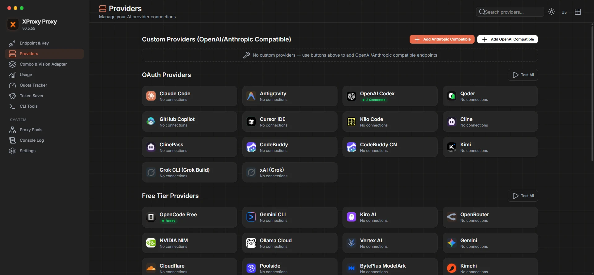
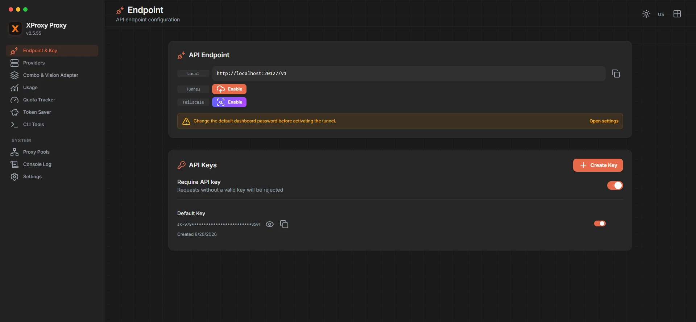
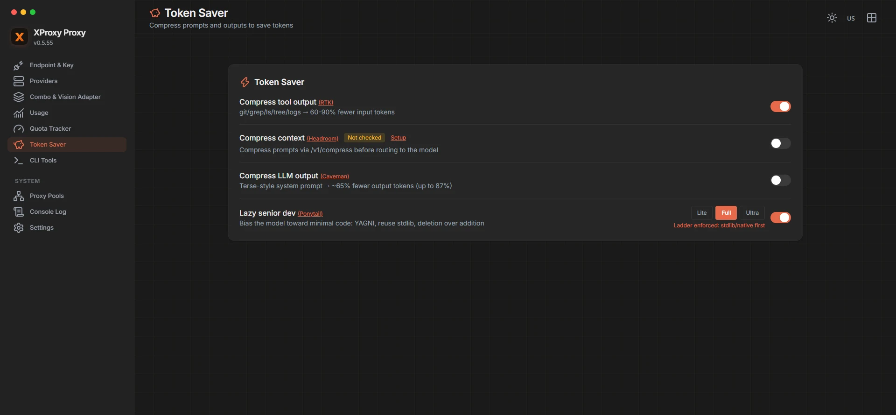

<div align="center">
  

  # XProxy

  ### One local endpoint for every AI coding workflow.

  Route requests, rotate accounts, translate provider formats, inspect usage, and keep tool-heavy sessions lean.

  [Get Started](#get-started) · [Token Saver](#token-saver) · [Configuration](#configuration) · [Tieng Viet](./README.vi.md)

  [](https://nodejs.org/)
  [](https://github.com/chieudoo/xproxy)
  [](https://hub.docker.com/)
</div>

---

<p align="center">
  
</p>

## The Control Plane For Your Agents

Your editor, CLI, and coding agents speak different APIs. Your providers expose different models, quotas, credentials, and response formats. XProxy sits between them so your tools use one endpoint while you keep control of the route.

```text
 Claude Code   Codex   Cursor   Cline   OpenCode   OpenClaw
      \          |       |       |        |          /
       \         |       |       |        |         /
        └──────────── XProxy : PORT /v1 ───────────┘
                         │
       ┌─────────────────┼──────────────────┐
       │                 │                  │
  Translation       Token Saver        Routing
  OpenAI/Claude/    RTK/Headroom/      accounts, aliases,
  Gemini/Responses  Caveman/Ponytail   fallbacks, quotas
       │                 │                  │
       └─────────────────┴──────────────────┘
                         │
             AI providers and local gateways
```

| Connect once | Keep moving | See what happened |
| --- | --- | --- |
| Use one OpenAI-compatible base URL across compatible tools. | Rotate accounts and fall back when a provider or quota is unavailable. | Inspect requests, token usage, cache reads, costs, and provider health. |

## Built For Real Agent Traffic

### Route without rewriting your workflow

- Connect OAuth and API-key providers from the dashboard.
- Use model aliases and provider/model identifiers from one endpoint.
- Rotate multiple accounts and apply model-combo fallback.
- Configure Claude Code, Codex, Cursor, Cline, OpenCode, OpenClaw, and other compatible clients in **Dashboard > CLI Tools**.

### Translate at the edge

- OpenAI Chat Completions, OpenAI Responses, Claude, Gemini, and provider-native formats.
- Streaming and non-streaming responses.
- Tool calls, reasoning, images, embeddings, TTS, STT, search, and provider-specific capabilities where supported.

### Operate locally

- Dashboard for providers, API keys, usage, request details, pricing, tunnels, and diagnostics.
- OAuth refresh, quota tracking, provider health checks, and outbound proxy support.
- Optional Cloudflare Tunnel, Tailscale, MITM, and Headroom services.

<p align="center">
  
  
</p>

## Get Started

**Requires Node.js 22.5.0 or later.**

### Run from source

```bash
git clone https://github.com/chieudoo/xproxy.git
cd xproxy
cp .env.example .env
npm install
npm run dev
```

Set the port you want in `.env`:

```env
PORT=20127
```

Then open:

```text
Dashboard  http://localhost:<PORT>/dashboard
API        http://localhost:<PORT>/v1
```

### Connect your first tool

1. Open **Dashboard > Providers** and connect an upstream provider.
2. Open **Dashboard > Endpoint & Key** and create an API key.
3. Point your client to XProxy:

```text
Base URL  http://localhost:<PORT>/v1
API Key   Your XProxy API key
Model     provider/model
```

The dashboard generates tool-specific instructions under **CLI Tools**.

### Production

```bash
npm run build
npm run start
```

For containers and persistent data, see [DOCKER.md](./DOCKER.md).

## Token Saver

Token Saver modifies the final upstream request, not your client configuration.

| Mechanism | What it does | Default |
| --- | --- | --- |
| **RTK** | Compresses large structured tool output: diffs, grep results, trees, build output, and repeated logs. | On |
| **Headroom** | Sends history to a configured `/v1/compress` service. Fails open if unavailable. | Off |
| **Caveman** | Appends a terse-response system instruction. | Off |
| **Ponytail** | Appends a minimal-code system instruction. | Off |

Disable every saver for an individual request:

```http
x-xproxy-token-saver: off
```

RTK only acts when it finds a compressible tool result. Ponytail and Caveman are visible in the final upstream payload, not the raw client request.

## Configuration

Copy `.env.example` to `.env`. These are the most useful settings:

| Variable | Purpose |
| --- | --- |
| `PORT` | Port for the dashboard and OpenAI-compatible API |
| `DATA_DIR` | Persistent database and application-data directory |
| `HOSTNAME` | Bind host for the production server |
| `LOG_LEVEL` | Console verbosity: `debug`, `info`, `warn`, or `error` |
| `ENABLE_REQUEST_LOGS` | Write detailed request/response traces and enable request details |
| `HTTP_PROXY`, `HTTPS_PROXY`, `ALL_PROXY` | Optional outbound proxy for provider requests |

## Observability And Privacy

The usage dashboard tracks requests, input/output tokens, cached tokens, provider/model totals, and estimated cost.

Set `ENABLE_REQUEST_LOGS=true` only when debugging. It writes full request and response traces under `logs/`, which can contain prompts, responses, cookies, and API credentials. Protect or delete those files afterwards.

## Development

```bash
npm run dev
npm run build
npx vitest run --exclude ".next/**"
```

## License

See [LICENSE](./LICENSE).
